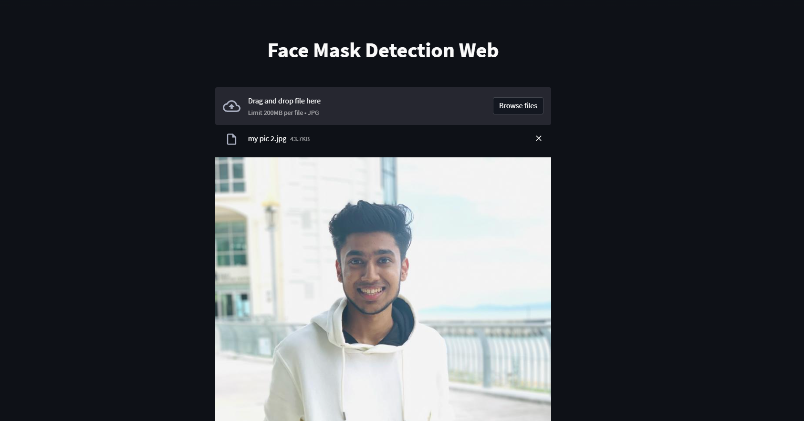

# FaceMaskProject
Face mask Recognition using ResNet50V2





Installation

1. Run the following command in your Terminal/Command Prompt to install the libraries required
```
pip install -r requirements.txt
```

2. Since, model file is not uploaded in this repo due to large file size,thus you need to train the model first
```
python train.py -d <path to dataset>
```
2. Run app.py
```
streamlit run app.py
```
